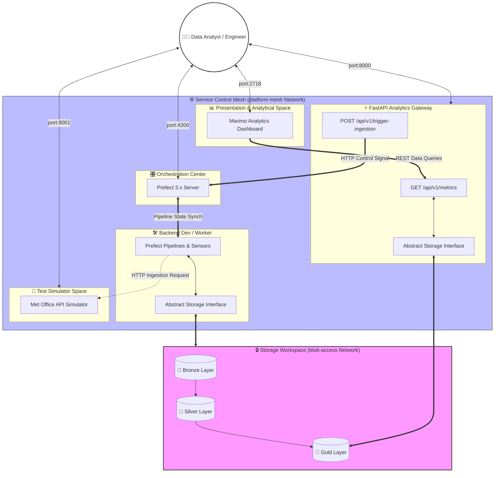

# Platform Intention
This project is intended to showcase a Containerised Data Platform. The design is intended to be free to spin up locally so anyone can run it, but scalable to cloud infrastructure and cloud agnostic.

## Users:
* **Data Automation**: users of the platform want data that is up to date, validated, and enhanced. Data transformations and orchestration with prefect is completed in `backend/` 
* **API Users**: users of the platform want public access to the data, but the platform must control what users can and cant interact with. A FastAPI application in `api/` provides a public endpoint for data that is explicitly for public use.
* **Data Analysts**: users of the platform may want to explore the available data without downloading it. `frontend/` contains marimo notebooks and tools that allow users to analyse the data interactively, in their browser. 

## Use Case
Climate data is loaded into a data lake and transformed to enable health-driven analytics. 

# 💻 Local Environment Prerequisites

To run the whole platform the host machine must satisfy the following system requirements:

1. **Git**: Git must be installed on your host machine.
2. **Docker Engine**: Docker must be installed and running on your host machine.
3. **Execution**:
```shell
git clone https://github.com/neilmolky/environmental-health-platform
cd environmental-health-platform 
docker compose up
```
4. **Useage**: with the services deployed, you should be able to access 4 endpoints in your browser. Ensure no other services are running on these ports.
    - localhost:8000 -> The api analysts would use to get data or manually trigger pipelines.
    - localhost:8001 -> The fake api mock service mirrors.
    - localhost:4200 -> The prefect server orchestrating data pipelines
    - localhost:2718 -> The marimo interactive analysis platform

*See also: CONTRIBUTING.md explains how to set up a dev-container if you want to add features and test them locally*


# System Design
The system exposes 4 ports as services. 


